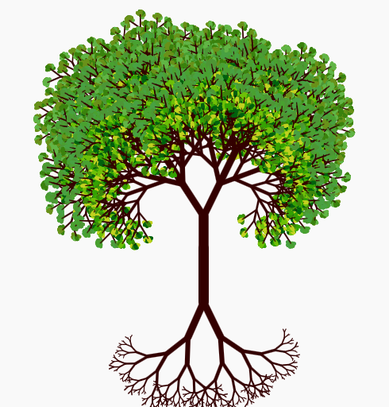
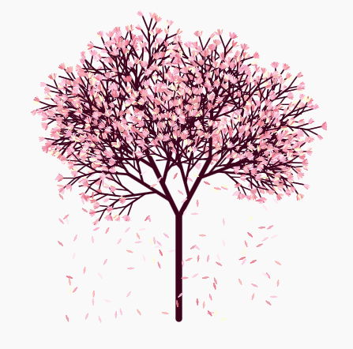
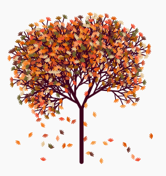

# Recursion Tree
A tree created with turtle python
coded by: Worakrit Kullanatpokin

Instruction: The result will differ due to randomization in the code. Also, it may take a minute to complete. Pure recursion with loops and if-elses.

# 00. Traditional tree

List of features
- random an angle for every branch
- random color
- random the length of each branch (shorter at the end)
- additional branches from the main branch
- changing color for the deeper branch
- root
https://trinket.io/python/3951eccaa3

# 01. Lemon tree: https://trinket.io/python/13ab6ae564
List of features
- random an angle for every branch
- random color
- random the length of each branch (shorter at the end)
- additional branches from the main branch
- changing color for the deeper branch
- set heading

Anyway, here is the hook lyrics of the song "Lemon Tree" by Fools Garden.
“I wonder how, I wonder why
Yesterday, you told me 'bout the blue, blue sky
And all that I can see is just a yellow lemon tree
I'm turnin' my head up and down
I'm turnin', turnin', turnin', turnin', turnin' around
And all that I can see is just another lemon tree”

I hope TAs and Instructors will understand my code. From now on, These are by far the most complex and organized.

# 02. Sakura tree: https://trinket.io/python/eeab5c1cd5
What a view of the sakura tree. It would be nice if I ever had a chance to experience such view.
List of features
- random an angle for every branch
- random color
- random the length of each branch
- random the number of additional branches from the main branch
- left right randomizer for additional branch (to indicate which path will go first)
- A recursion catcher for preventing calling the recursive function twice to draw the next branch, and it will call draw_flowers only once.
- randomly not draw a sakura at the end of the branch (1 in 6 chance or about 16.67%)
- falling petals randomizer (This one has 2 version. One with wind and no wind. They also work differently)

# 03. Autumn tree (Sakura modded): https://trinket.io/python/0029dfdfad
This version is sakura modded version. Overall, both Sakura and Autumn tree have similar code structure.
List of features
- random an angle for every branch
- random color
- random the length of each branch
- random the number of additional branches from the main branch
- left right randomizer for additional branch (to indicate which path will go first)
- A recursion catcher for preventing calling the recursive function twice to draw the next branch, and it will call draw_flowers only once.
- randomly not draw a leaf at the end of the branch (1 in 6 chance or about 16.67%)
- falling leaves randomizer (This one has 2 version. One with wind and no wind. They also work differently)

